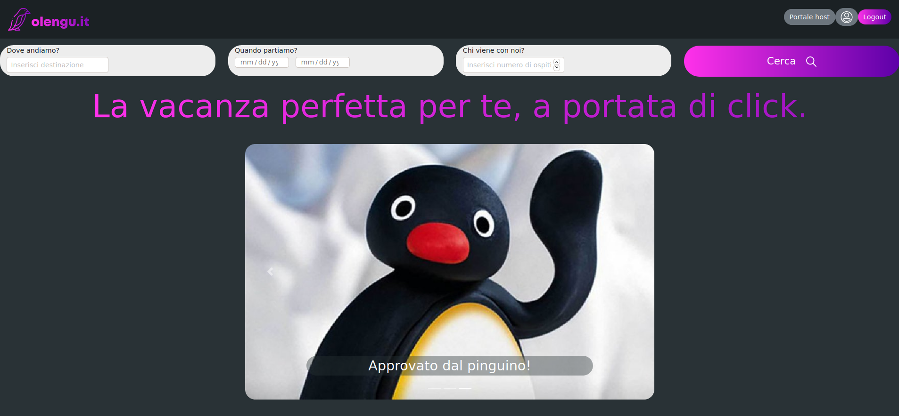
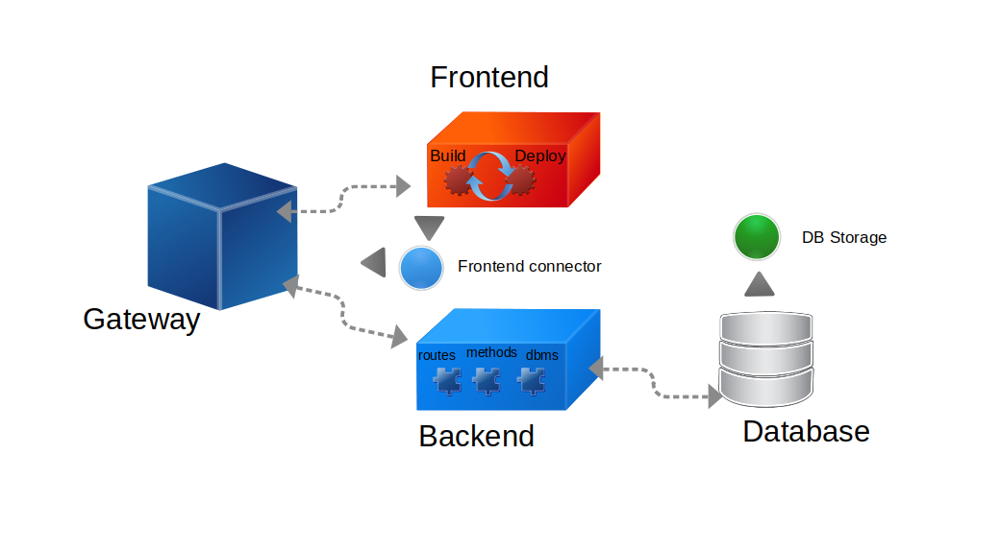

# Olengu Vacanze

Portale di prenotazione per case vacanza.




# Licenza

Questo programma è condiviso sotto licenza GNU Affero Public License versione 3 o successive.

    This program is free software: you can redistribute it and/or modify
    it under the terms of the GNU General Public License as published by
    the Free Software Foundation, either version 3 of the License, or
    (at your option) any later version.

    This program is distributed in the hope that it will be useful,
    but WITHOUT ANY WARRANTY; without even the implied warranty of
    MERCHANTABILITY or FITNESS FOR A PARTICULAR PURPOSE.  See the
    GNU General Public License for more details.

    You should have received a copy of the GNU General Public License
    along with this program.  If not, see <http://www.gnu.org/licenses/>.

[maggiori informazioni sulla licenza](./LICENSE.md)

# Documentazione

Per questo progetto è disponibile la documentazione relativa all'architettura in formato PDF

[Requirements](./doc/documentazione.pdf)
[RAD](./doc/RAD.pdf)
[ODD](./doc/ODD.pdf)
[SDD](./doc/SDD.pdf)

# Infrastruttura

## Note sull'architettura

Questo progetto è gestito mediante docker-compose, che si occupa di creare e orchestrare i container nei quali vengono avviati i singoli componenti del progetto.



### Frontend

Il container frontend ha l'unico scopo di compilare il progetto React.js e consegnare una versione statica completa al container gateway

### Backend

Il container backend si occupa di avviare il server Express.js in un ambiente già provvisto di tutte le dipendenze richieste e di avviare il servizio n background esponendone la porta al gateway

### Gateway

Il gateway è un webserver nginx the serve i file statici del frontend React.js e fa da reverse proxy tra l'utente e le API del backend Express.js

Il gateway è il punto di incrontro tra backend e frontend che permette ad entrambi i servizi di coesistere sulla stessa porta pubblica e di essere scalabili orizzontalmente per ottimizzarne le perfrmance.

Inoltre il gateway è il componente che abilita il supporto a **HTTPS** per le connessioni sicure verso la piattaforma.

In caso di mancata configurazione di un certificato ssl valido, un certificato snakeoil autofirmato sarà usato a suo posto.

### Database

 Il database è un'istanza di mysql orchestrata in un container dedicato che ne inizializza automaticamente username, password, nome del database di default e altri dettagli di configurazione per il primo deploy.

 I dati del database vengono salvati in una cartella locale che ne permette la facile condivisione tra piu server, la migrazione su altri server e il backup locale.

    NOTA: il container del database potrebbe richiedere diversi minuti durante il primo avvio per essere inizializzato e diiventare utilizzabile dal backend. Il sito potrebbe non essere operativo durante questo periodo.


# Installazione

Le seguenti istruzioni sono disponibili per il deploy dell'applicativo su un server debian.

Altre piattaforme sono supportate purchè abbiano **docker**, **docker-compose**, **git** e **make**


## Installare e dipendenze

```bash
    sudo apt update
    sudo apt -y install docker.io docker-compose git make
```

## Clonare il repository sul branch production

```bash
    git clone -b prod https://github.com/marafed/olengu olengu
```

## Inizializzare e avviare il progetto

```bash
    cd olengu
    make start
```

## Altri comandi utili

**make start**
    avvia tutti i servizi
    può essere usato per un riavvio dell'infrastruttura

**make stop**
    spegne tutti i servizi

**make log-backend**
    legge in tempo reale i log del backend

**make log-frontend**
    legge in tempo reale i log del frontend

**make log-db**
    legge in tempo reale i log del database
